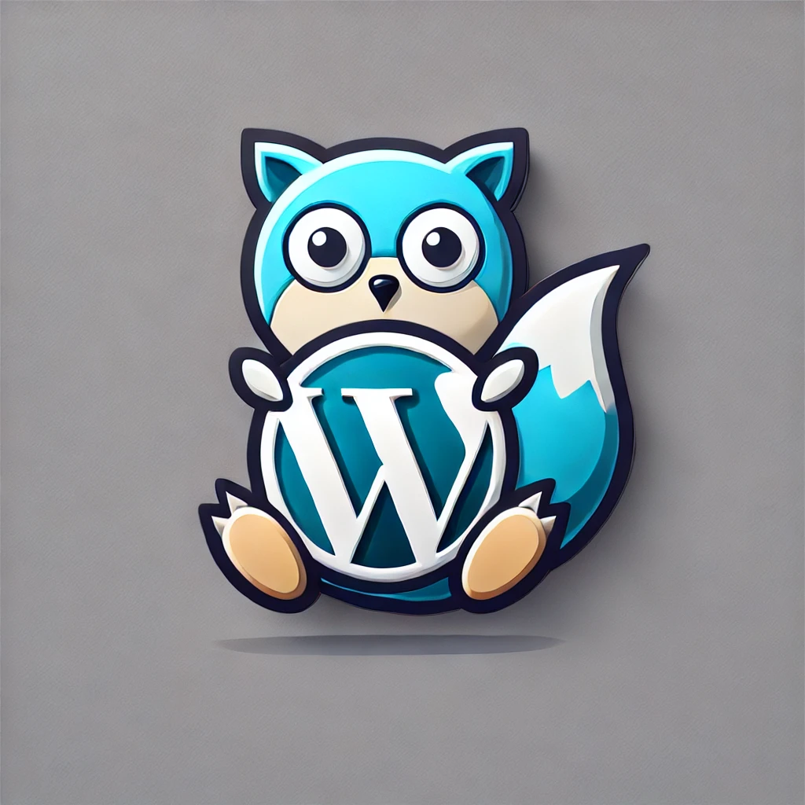

    

GoPress is a simple CSM (Content Management System) written in Go. It provides basic functionalities to manage content and users efficiently.

## Features

<!-- - Admin panel for content and user management
- Public API for accessing content
- In-memory content caching for improved performance -->

TODO:
admin pandel:
- [ ] image upload handling to pg
- [x] adding new content
- [ ] changing self password
- [ ] page view statistics
- [ ] preview mode
- [ ] ...
public api:
- [ ] get content list (with tag filters)
- [ ] get content by id
- [ ] articel statistics api
additional:
- [ ] members handling - adding new members with password
- [ ] in memory content caching

## Options for docker image:
- [ ] usage domain (for inner-links and CORS)
- [ ] GoPress domain (for analytic links generation)
- [ ] postgres connection uri
